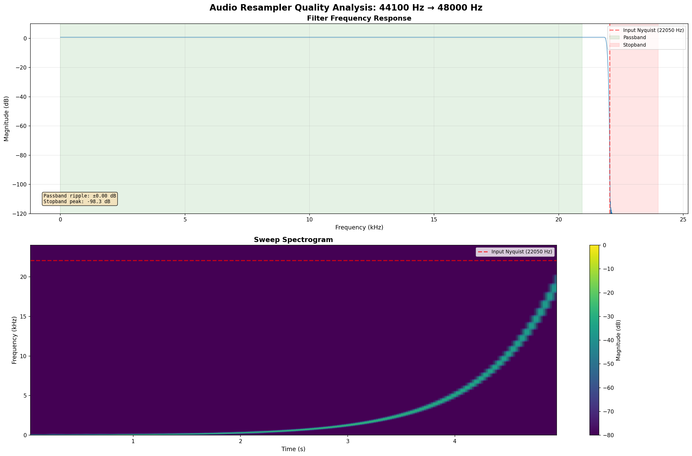
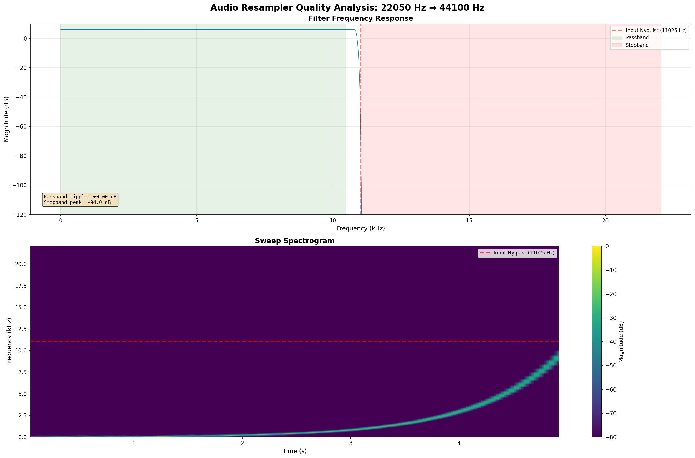

# resampler

Resampler is a small, zero-dependency crate optimized for resampling audio data from one sampling rate to another.
Optimized for the most common audio sampling rates.

## Usage Example

```rust
use resampler::{Resampler, SampleRate};

// Create a stereo resampler (2 channels) from 44.1 kHz to 48 kHz.
let mut resampler = Resampler::<2 >::new(SampleRate::Hz44100, SampleRate::Hz48000);

// Get required buffer sizes (already includes all channels).
let input_size = resampler.chunk_size_input();
let output_size = resampler.chunk_size_output();

// Create input and output buffers (interleaved format: [L0, R0, L1, R1, ...]).
let input = vec![0.0f32; input_size];
let mut output = vec![0.0f32; output_size];

// Process audio.
match resampler.resample( & input, & mut output) {
Ok(()) => println ! ("Resample successful"),
Err(error) => eprintln ! ("Resampling error: {error:?}"),
}
```

## Implementation

The resampler uses an FFT-based overlap-add algorithm with Kaiser windowing for high-quality audio resampling.
Key technical details:

- Custom mixed-radix FFT with the standard Cooley-Tukey algorithm.
- SIMD optimizations: All butterflies have SSE, AVX, and ARM NEON implementations with compile time CPU feature
  detection.
- Real-valued FFT: Exploits conjugate symmetry for 2x performance.
- Kaiser window: Beta parameter of 10.0 provides excellent stopband attenuation of -100 dB while maintaining good
  time-domain localization.
- Optimal configurations: Pre-computed FFT sizes and factorizations for all supported sample rate pairs, with throughput
  scaling to ensure a latency around 256 samples.

## Performance

SSE on x86_64 and NEON on aarch64 are enabled by default. But to get the best performance on x86_64 AVX (+avx) and FMA
(+fma) should be enabled at compile time as a target feature.

## no-std Compatibility

The library supports `no-std` environments with `alloc`. To use the library in a `no-std` environment, enable the
`no_std` feature:

```toml
[dependencies]
resampler = { version = "0.1", features = ["no_std"] }
```

### Behavior Differences

When the `no_std` feature is enabled:

- FFT Caching: The library will not cache FFT objects globally. Each `Resampler` instance will create its own FFT
  objects and filter spectra. This increases creation time and memory consumption for multiple `Resampler` for the same
  configuration.

The default build (without `no_std` feature) has zero dependencies and uses the standard library for optimal performance
and memory efficiency through global FFT caching.

## Quality Analysis

The following spectrograms demonstrate the high-quality output of the resampler across different conversion scenarios:

### 44.1 kHz → 48 kHz Conversion



### 22.05 kHz → 44.1 kHz Conversion



## Alternatives

Other high-quality audio resampling libraries in Rust are:

- [Rubato](https://github.com/HEnquist/rubato): The overlap-add resampling approach used in this library is based on
  Rubato's implementation.

## License

Licensed under either of

- Apache License, Version 2.0, (LICENSE-APACHE or http://www.apache.org/licenses/LICENSE-2.0)
- MIT license (LICENSE-MIT or http://opensource.org/licenses/MIT)

at your option.

## Contribution

Unless you explicitly state otherwise, any contribution intentionally submitted for inclusion in the work by you, as
defined in the Apache-2.0 license, shall be dual licensed as above, without any additional terms or conditions.
