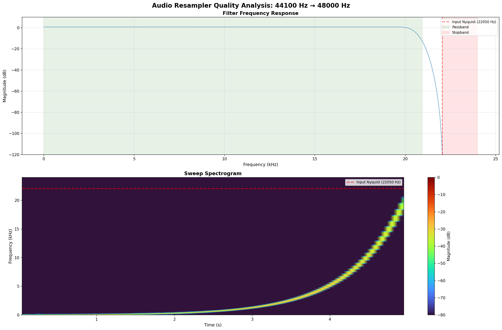

# resampler

[](https://github.com/hasenbanck/resampler/actions/workflows/rust.yml)
[](https://crates.io/crates/resampler)
[](https://docs.rs/resampler)

Resampler is a small, zero-dependency crate for high-quality audio resampling between common sample rates.
It provides both FFT-based and FIR-based resamplers optimized for different use cases.

## Usage Examples

### FFT-Based Resampler (Highest Quality)

```rust
use resampler::{ResamplerFft, SampleRate};

// Create a stereo resampler (2 channels) from 44.1 kHz to 48 kHz.
let mut resampler = ResamplerFft::<2>::new(SampleRate::Hz44100, SampleRate::Hz48000);

// Get required buffer sizes (already includes all channels).
let input_size = resampler.chunk_size_input();
let output_size = resampler.chunk_size_output();

// Create input and output buffers (interleaved format: [L0, R0, L1, R1, ...]).
let input = vec![0.0f32; input_size];
let mut output = vec![0.0f32; output_size];

resampler.resample(&input, &mut output).unwrap();
```

### FIR-Based Resampler (Low Latency, Streaming)

```rust
use resampler::{Attenuation, Latency, ResamplerFir, SampleRate};

// Create a stereo resampler with configurable latency (16, 32, or 64 samples).
let mut resampler = ResamplerFir::<2>::new(
    SampleRate::Hz48000,
    SampleRate::Hz44100,
    Latency::Sample64,
    Attenuation::Db90,
);

// Streaming API - accepts arbitrary input buffer sizes.
let input = vec![0.0f32; 512];
let mut output = vec![0.0f32; resampler.buffer_size_output()];

let (consumed, produced) = resampler.resample(&input, &mut output).unwrap();
println!("Consumed {consumed} samples, produced {produced} samples");
```

## Choosing a Resampler

Both resamplers provide good quality, but are optimized for different use cases:

| Feature     | ResamplerFft                     | ResamplerFir                 |
|-------------|----------------------------------|------------------------------|
| Quality     | Very good (sharp rolloff)        | Good (slow rolloff)          |
| Performance | Very fast                        | Fast (configurable)          |
| Latency     | ~256 samples                     | 16-64 samples (configurable) |
| API         | Fixed chunk size                 | Flexible streaming           |
| Best for    | Non-latency sensitive processing | Low-latency processing       |

Use ResamplerFft when:
- You need the absolute highest quality
- Latency is not a concern
- Processing pre-recorded audio files

Use ResamplerFir when:
- You need low latency (real-time audio)
- You can live with a slower rolloff
- Working with streaming data

## FFT-Based Implementation

The resampler uses an FFT-based overlap-add algorithm with Kaiser windowing for high-quality audio resampling.
Key technical details:

- Custom mixed-radix FFT with the standard Cooley-Tukey algorithm.
- SIMD optimizations: All butterflies have SSE, SSE3, AVX, and ARM NEON implementations.
- Stopband attenuation of -100 dB using the Kaiser windows function.
- Latency around 256 samples.

## FIR-Based Implementation

The FIR resampler uses a polyphase filter with linear interpolation for high-quality audio resampling with low latency.
Key technical details:

- Polyphase decomposition: 1024 phases with linear interpolation between phases
- SIMD optimizations: Convolution kernels optimized with SSE, SSE3, AVX, AVX-512, and ARM NEON
- Configurable filter length: 32, 64, or 128 taps (16, 32, or 64 samples latency)
- Adjustable rolloff and stopband attenuation
- Streaming API: Accepts arbitrary input buffer sizes for flexible real-time processing

## Performance

Both resamplers include SIMD optimizations with runtime CPU feature detection for maximum performance and compatibility.

But for up to 25% better performance on x86_64, compile with `target-cpu=x86-64-v3` (enables AVX2, FMA, and other
optimizations).

## no-std Compatibility

The library supports `no-std` environments with `alloc`. To use the library in a `no-std` environment, enable the
`no_std` feature:

```toml
[dependencies]
resampler = { version = "0.2", features = ["no_std"] }
```

### Behavior Differences

When the `no_std` feature is enabled:

- Caching: The library will not cache FFT and FIR objects globally to shorten resampler creation time and lower overall
  memory consumption for multiple resamplers.

- No runtime detection of SIMD functionality. You need to activate SIMD via compile time target features.

The default build (without `no_std` feature) has zero dependencies and uses the standard library for optimal performance
and memory efficiency through global caching.

## Quality Analysis

The following spectrograms demonstrate the high-quality output of the resampler across different conversion scenarios:

### 44.1 kHz → 48 kHz Conversion With FFT Resampler


### 44.1 kHz → 48 kHz Conversion With FIR Resampler



## Alternatives

Other high-quality audio resampling libraries in Rust are:

- [Rubato](https://github.com/HEnquist/rubato): The overlap-add resampling approach used in this library is based on
  Rubato's implementation.

## License

Licensed under either of

- Apache License, Version 2.0, (LICENSE-APACHE or http://www.apache.org/licenses/LICENSE-2.0)
- MIT license (LICENSE-MIT or http://opensource.org/licenses/MIT)

at your option.

## Contribution

Unless you explicitly state otherwise, any contribution intentionally submitted for inclusion in the work by you, as
defined in the Apache-2.0 license, shall be dual licensed as above, without any additional terms or conditions.
